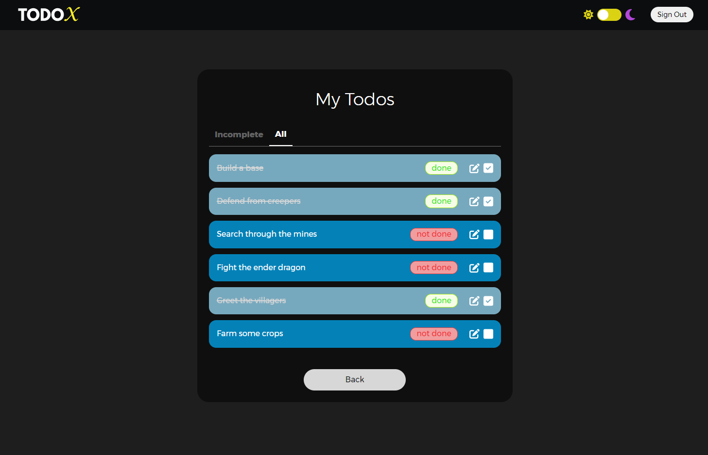

# 📝 Todo Manager

Todo Manager is a full-stack web application that helps users manage their daily tasks. The app allows users to create, edit, delete, and mark tasks as complete with a streamlined, modern interface. Built using the MERN (MongoDB, Express, React, Node.js) stack, this project demonstrates the integration of user authentication, state management, and dark mode support.

## ✨ Features

- **Task Management**: Add, edit, and delete todos with a clean UI.
- **Task Completion**: Mark tasks as complete with a single click.
- **Dark Mode**: Switch between light and dark modes depending on user preference.
- **Session Persistence**: User sign-in state persists across page reloads.
- **Redux for State Management**: Efficiently manage app state with Redux.
- **Responsive Design**: Mobile-friendly and adaptable to various screen sizes.

## 📺 App Preview



## 🛠 Technologies Used

- **MongoDB**: NoSQL database for storing user and todo data.
- **Express**: Backend framework for building the REST API.
- **React**: Frontend JavaScript library for building the user interface.
- **Node.js**: Runtime environment for executing JavaScript on the server.
- **Redux**: State management library for predictable state changes.
- **Next.js**: React framework for server-side rendering and routing.
- **Styled-components**: For styling components dynamically based on props.

## 🚀 Getting Started

To get a local copy of the project up and running, follow these steps:

### Prerequisites

- The latest version of Node.js and npm installed.
- MongoDB set up and running locally or with a cloud service like MongoDB Atlas.

### Installation

1. Clone the repository:
    ```bash
    git clone https://github.com/rithik-c/TodoX.git
    ```

2. Navigate to the project directory:
    ```bash
    cd TodoX
    ```

3. Install server and client dependencies in separate terminals:
    ```bash
    # Terminal 1
    cd backend
    npm install

    # Terminal 2
    cd frontend
    npm install
    ```

5. Run the backend server and frontend client:
    ```bash
    # Terminal 1
    npm start

    # Terminal 2
    npm run dev
    ```

7. Open your browser and navigate to `http://localhost:3000` to see the app.
